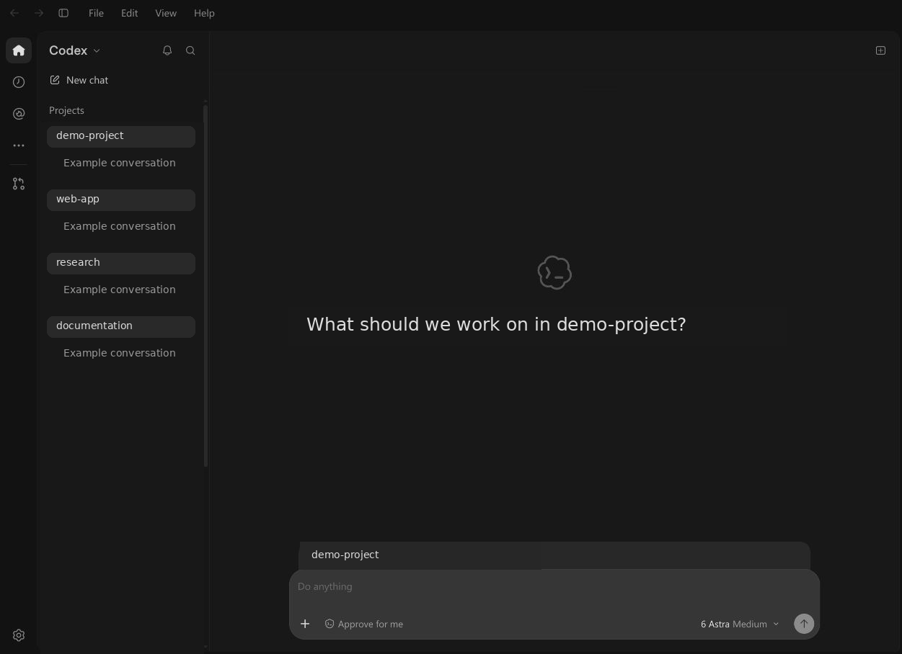

# chatgpt-webui

[简体中文](README.md) | **English**

Remotely use the original ChatGPT Desktop interface in your browser to manage Codex projects and conversations on the host machine.

This project reuses the installed app's HTML, JavaScript, CSS, and backend, adapting Electron communication through WebSocket.

> An unofficial, experimental project with no affiliation with OpenAI. This repository distributes only the adapter code. It does not include ChatGPT installation packages, original frontend assets, account credentials, or conversation data. Users must install the desktop app and sign in.

## Preview



## Features

- Use the original project sidebar, conversation list, and chat interface in a browser.
- Keep the original app backend and local Codex configuration, tools, and conversation storage.
- Browse folders on the **host machine** in a web dialog and add projects. Supports entering a path, navigating to the parent or home directory, and showing hidden folders.
- Forward standard IPC, worker messages, and App-host MessagePort communication to the browser.
- Choose randomly generated access tokens, a fixed token, or token-free access.
- Access the app through SSH forwarding or an Nginx HTTPS / WebSocket reverse proxy.
- Generate a disposable app copy with source-version and patch-checksum records, making it easier to reapply changes after upgrades.

## Attachments: client or host files

Use the original **Add files** action in a conversation. The adapter offers two sources:

- **Client files**: choose files from the device running your browser. Files are uploaded to the host before being handed to the original attachment flow.
- **Host files**: browse the filesystem of the machine running the App, select one or more files, and add them without copying their contents through the browser.

You can also drop client files onto the original conversation input. The adapter uploads them, supplies host paths, and replays the drop for the original App. Client folder drops are not supported. File type restrictions from the original picker still apply.

Client uploads are limited to **32 MiB per file** (matching the Nginx template). Uploaded files use isolated directories under `.uploads/`, which is ignored by Git. Canceled and failed uploads are removed; files handed to the App are retained so conversation references remain valid. Removing an attachment in the original UI does not automatically delete its staged file. Clean retained files manually only when no conversation needs them.

HTTP/WebSocket attachment tests and drop-handler unit tests pass. Browser interactions for these new flows are awaiting manual acceptance; no model request is sent by the protocol tests.

## Requirements

- Linux; currently tested on Arch Linux.
- ChatGPT Desktop: an existing installation can be reused. If none is found, the launcher asks before downloading it into the repository.
- Currently adapted package version: `chatgpt-desktop 26.930.21537-1`.
- Node.js 22+/npm and Python 3.11+: the launcher checks for them and asks before installing missing runtimes locally. `flock` is not required.
- At least 3 GiB of free space is recommended for the initial downloads. Basic bootstrap tools are a POSIX shell, curl or wget, tar, sha256sum, and Linux `ldd`.
- The host must provide Electron's native libraries, including glibc, GTK, and NSS. Missing libraries are checked before startup.

## Quick start

Download this repository and enter its directory:

```sh
scripts/start.sh --ozone-platform=headless --disable-gpu
```

On first launch, the script checks Python, Node/npm, the app, native shared libraries, and project dependencies. Before a required download, it displays the source, version, and destination, then asks `Continue [y/N]`. Pressing Enter or entering `n` stops setup.

```sh
# Check the environment without downloading or starting the app
scripts/start.sh --check

# Install dependencies and prepare the app copy without starting it
scripts/start.sh --setup-only

# Explicitly approve all repository-local downloads for unattended setup
scripts/start.sh --yes --setup-only
scripts/start.sh --yes --ozone-platform=headless --disable-gpu
```

Noninteractive sessions do not grant approval automatically: pass `--yes` or set `CHATGPT_WEB_SETUP_YES=1`. Once requirements are satisfied, normal startup does not repeat the prompts or downloads. Use `--help` for launcher options; other arguments are passed through to Electron.

Automatic installation covers:

| Component | Source and version | Repository location |
| --- | --- | --- |
| ChatGPT Desktop | [Official Linux distribution](https://learn.chatgpt.com/docs/linux/linux-app); pinned to the adapted version `26.930.21537`, selecting the x64 / ARM64 `.deb` and verifying a pinned SHA-256 | `.deps/chatgpt-<version>-<architecture>/` |
| Node.js + npm | [nodejs.org](https://nodejs.org/dist/latest-v22.x/); resolves the current Node 22 LTS release at installation time and verifies its official SHA-256 | `.deps/node/` |
| Python | [Astral uv](https://docs.astral.sh/uv/guides/install-python/) downloads a Python 3.12 standalone build; this is not a Linux binary published by python.org | `.deps/python/`, `.deps/uv/` |
| npm dependencies | `package-lock.json`, installed with `npm ci --ignore-scripts` | `node_modules/`, with cache in `.deps/cache/` |

The app's `.deb` is used **only to extract app files**. No package maintenance scripts are executed, no system package is registered, and neither sudo nor changes to the system PATH or shell configuration are required.

Open the login URL printed in the terminal, such as `http://127.0.0.1:18765/login?token=...`. The current URL is also saved in `.logs/access-url`.

The default listening address is `127.0.0.1:18765`. Press `Ctrl+C` to stop the service. Without the headless arguments, the app displays a local window, which can be used for initial sign-in:

```sh
scripts/start.sh
```

After signing in, stop the windowed instance and start the headless version if desired. Sign-in behavior may vary between app versions.

### Three access-token modes

The access token controls access to this Web UI only. **It is not an OpenAI API key and does not replace signing in to the app.**

**Default: generate a random token on each start**

```sh
scripts/start.sh --ozone-platform=headless --disable-gpu
```

After a restart, the old URL and cookies are invalid. Open the new URL from `.logs/access-url`.

**Use a fixed token**

```sh
export CHATGPT_WEB_ACCESS_TOKEN='replace-with-a-long-random-secret'
scripts/start.sh --ozone-platform=headless --disable-gpu
```

Use at least 16 characters. A random value generated with `openssl rand -hex 32` is recommended.

**Disable access-token authentication**

```sh
unset CHATGPT_WEB_ACCESS_TOKEN
CHATGPT_WEB_AUTH=none scripts/start.sh --ozone-platform=headless --disable-gpu
```

Open `http://127.0.0.1:18765/` directly. Anyone who can reach the service can operate the host app in this mode. Use it only on a trusted local machine, through a private tunnel, or behind a reverse proxy with separate authentication. **Do not expose an unauthenticated endpoint directly to the public internet.** WebSocket connections still enforce the page Origin even when token authentication is disabled.

### Configuration

| Environment variable | Default | Purpose |
| --- | --- | --- |
| `CHATGPT_APP_DIR` | Auto-detected | Directory containing an installed or manually extracted app |
| `CHATGPT_WEB_PYTHON` | System or local Python | Explicit path to the bootstrap Python interpreter |
| `CHATGPT_WEB_SETUP_YES` | `0` | Set to `1` to approve repository-local installation, equivalent to `--yes` |
| `CHATGPT_WEB_PORT` | `18765` | Local listening port |
| `CHATGPT_WEB_AUTH` | `token` | `token` or `none` |
| `CHATGPT_WEB_ACCESS_TOKEN` | Randomly generated | Custom access token; do not combine with `none` |
| `CHATGPT_WEB_ORIGIN` | `http://127.0.0.1:<port>` | The actual browser-facing origin, such as `https://chatgpt.example.com` |

`CHATGPT_WEB_ORIGIN` accepts a protocol, hostname, and optional port. Path prefixes are not supported. It controls the login URL, WebSocket Origin validation, CSP, and the Secure attribute on HTTPS cookies.

Examples of changing the app directory or port:

```sh
CHATGPT_APP_DIR=/path/to/chatgpt scripts/start.sh --setup-only
CHATGPT_WEB_PORT=18766 scripts/start.sh --ozone-platform=headless --disable-gpu
```

## Remote access

### SSH tunnel

Run this on the client machine:

```sh
ssh -N -L 18765:127.0.0.1:18765 user@target-machine
```

Then open the URL stored in `.logs/access-url` on the target machine. If the local forwarded port differs, set `CHATGPT_WEB_ORIGIN` on the host at startup to the address and port used by the browser.

### Nginx reverse proxy

Full template: [deploy/nginx.conf](deploy/nginx.conf). It assumes Nginx and the Web UI run on the same machine and serve the app at the root of a dedicated domain.

1. Replace `chatgpt.example.com` and the TLS certificate paths in the template.
2. Place the template in a configuration directory included by Nginx's `http {}` context, such as `/etc/nginx/conf.d/`.
3. Start the app with the matching public origin:

```sh
export CHATGPT_WEB_ORIGIN=https://chatgpt.example.com
export CHATGPT_WEB_ACCESS_TOKEN='replace-with-a-long-random-secret'
scripts/start.sh --ozone-platform=headless --disable-gpu
```

4. Run `sudo nginx -t` and reload Nginx after validation succeeds.
5. Open the **HTTPS** login URL printed in the terminal.

The template includes WebSocket Upgrade handling, long connection timeouts, and disabled proxy buffering. Access logging is disabled for this site to avoid recording tokens in login URLs. Make sure `CHATGPT_WEB_ORIGIN` exactly matches the browser-facing origin.

## Updates, rollback, and data locations

After updating the app, stop the Web UI and run:

```sh
scripts/start.sh --ozone-platform=headless --disable-gpu
```

Startup checks the source ASAR and patch checksums, rebuilding the copy only when files are missing or changed. Resource links are updated when switching app sources.

Data locations:

| Path | Contents |
| --- | --- |
| `.deps/` | Local tools, app downloads, caches, and installation records; excluded from Git |
| `.runtime/` | Regenerable app copy and resource links |
| `.uploads/` | Client files handed to the App; retain while conversations reference them |
| `.profile/` | Separate Electron sign-in state, preferences, and cache; retain during upgrades |
| `.logs/access-url` | Current access URL; treat it as a credential when it contains a token |
| `prepare-manifest.json` | Source app version, SHA-256, and patch SHA-256 values for the current copy |
| `.logs/prepare-history.jsonl` | Append-only preparation history |

All paths above are ignored by Git.

Only one browser WebSocket connection is currently supported. If a connection conflicts, close other connected tabs and try again.

## Development and validation

```sh
npm test
python3 -m unittest discover -s tests -p 'test_*.py'
# With the app running and the browser connection closed:
npm run test:integration
# Attachment protocol checks (no browser automation):
node scripts/smoke-attachments.cjs
# Integration checks for token-free mode:
CHATGPT_WEB_AUTH=none npm run test:integration
```

When testing through a reverse proxy, also set `CHATGPT_WEB_URL=https://chatgpt.example.com`. Tests read `.logs/access-url` and only inspect directories and app information; they do not create conversations or send model requests.

```text
Original web UI → electronBridge / MessagePort adapter → WebSocket
                → Original Electron main process → Original renderer / preload → Original app services
```

[Change log (Chinese)](docs/OPERATIONS.md) · [MIT License](LICENSE)

The MIT license applies only to the new code in this repository. The ChatGPT name, interface, and installation assets belong to their respective rights holders and are not licensed or distributed by this project.
